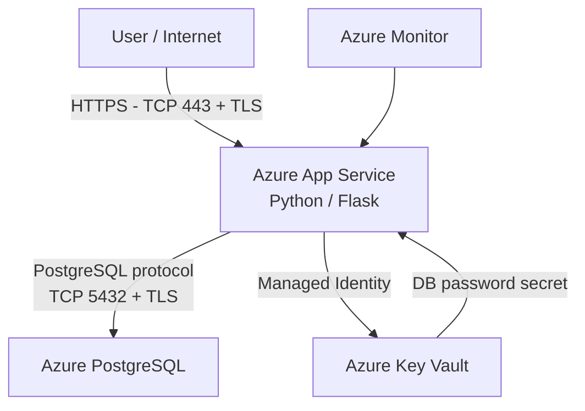

# Secure Cloud Infrastructure Project

Personal project focused on designing, deploying, securing and monitoring a cloud infrastructure on Microsoft Azure.

## Overview

This project consists of a Python Flask Web App deployed on Azure App Service and connected to an Azure Database for PostgreSQL Flexible Server.

The objective was not only to deploy an application, but also to understand and improve the infrastructure around it: networking, security, identity, secret management, monitoring, resilience and cost.

## Learning Approach

This project was a learning project.

I used AI as a learning assistant to help me understand the concepts, troubleshoot issues, and improve the architecture step by step.

It was a support tool to understand the reasoning behind each configuration, command and security decision.

## Architecture



### Main communication flows

**User → Web App**
- The Web App is publicly accessible.
- HTTPS is enforced.
- Traffic is protected with TLS over TCP port 443.

**Web App → PostgreSQL**
- The application connects using the PostgreSQL protocol over TCP port 5432.
- TLS encrypts the exchanged data.
- PostgreSQL firewall rules restrict which public source IP addresses are allowed to connect.

**Web App → Key Vault**
- The Web App uses a system-assigned Managed Identity.
- Azure RBAC authorizes this identity to read secrets from Key Vault.
- The PostgreSQL password is retrieved from Key Vault instead of being stored directly in the application configuration.

## Azure Resources

The project currently uses:

- Azure App Service
- App Service Plan F1
- Azure Database for PostgreSQL Flexible Server
- Azure Key Vault
- Microsoft Entra ID / Managed Identity
- Azure RBAC
- Azure Monitor
- Azure Monitor metric alert

## Security

### HTTPS

HTTPS is enforced on the Web App to protect HTTP traffic in transit using TLS.

### PostgreSQL Firewall

PostgreSQL currently uses a public endpoint, but access is restricted through firewall rules.

Only the required Azure App Service outbound IP addresses are authorized.

Direct access from the developer PC is not permanently allowed.

### Managed Identity and RBAC

The Web App has a **system-assigned Managed Identity** in Microsoft Entra ID.

RBAC follows the principle of least privilege:

- Web App → `Key Vault Secrets User`
- Developer account → `Key Vault Secrets Officer`

The application can read secrets, while the developer account can manage them.

### Secret Management

The PostgreSQL password is stored in Azure Key Vault.

The App Service `DB_PASSWORD` setting contains a **Key Vault reference** instead of the actual password.

The Python application can therefore keep using:

```python
os.getenv("DB_PASSWORD")
```

while Azure resolves the secret automatically.

The local `.env` file is excluded from Git to prevent secrets from being committed to the repository.

## Monitoring

Azure Monitor is used to supervise the Web App.

The project includes:

- Request metrics
- Application logs
- HTTP status monitoring
- An alert rule for HTTP 5xx errors
- A `/health` endpoint

The `/health` endpoint verifies the PostgreSQL dependency:

```text
HTTP 200 → Healthy
HTTP 503 → Unhealthy
```

Azure App Service Health Check was not enabled because the current Free F1 plan requires an upgrade for this feature in the Azure portal.

## Resilience

The current architecture prioritizes low cost over high availability.

### Web App

- Free F1 App Service Plan
- Single instance
- No instance redundancy

### PostgreSQL

- High Availability disabled
- 7-day backup retention
- Geo-redundant backup disabled

Backups provide recovery capabilities, while High Availability would reduce downtime in case of infrastructure failure.

## Architecture Decisions

The Web App remains public because users need to access it.

PostgreSQL and Key Vault currently use public network endpoints, but access is protected through:

- Firewall rules
- Authentication
- Managed Identity
- RBAC
- TLS

More advanced private networking was intentionally not deployed in order to keep the project within a low-cost student environment.

## Production Improvements

A production architecture could improve the current design with:

- VNet integration
- Private access for PostgreSQL
- Private access for Key Vault
- Stable outbound networking
- Multiple App Service instances
- PostgreSQL High Availability
- Automated Health Check
- More advanced centralized monitoring

The public Web App would remain accessible from the Internet, while backend services would communicate through private networking.

## Technologies

- Microsoft Azure
- Python
- Flask
- PostgreSQL
- Azure App Service
- Azure Database for PostgreSQL
- Azure Key Vault
- Microsoft Entra ID
- Azure RBAC
- Azure Monitor
- Git
- GitHub

## Key Concepts Learned

This project was used to practice and understand:

- Cloud architecture
- Public and private networking
- DNS and IP addressing
- TCP ports and TLS
- Firewall rules
- IAM and RBAC
- Managed Identities
- Secret management
- Monitoring and logging
- Health checks
- Security auditing
- Resilience
- Cost optimization
- Azure CLI